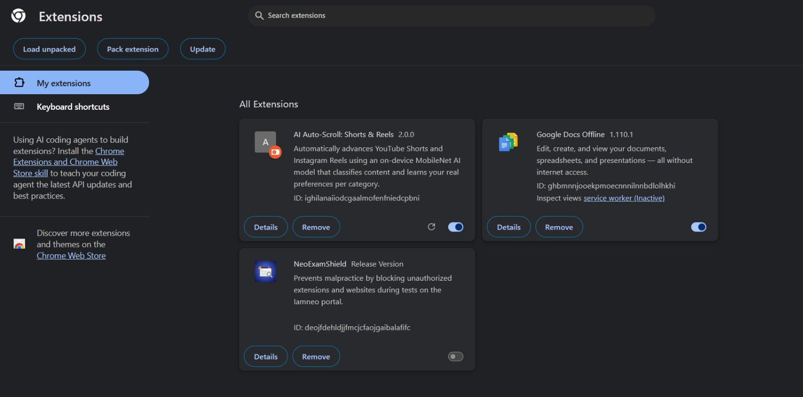
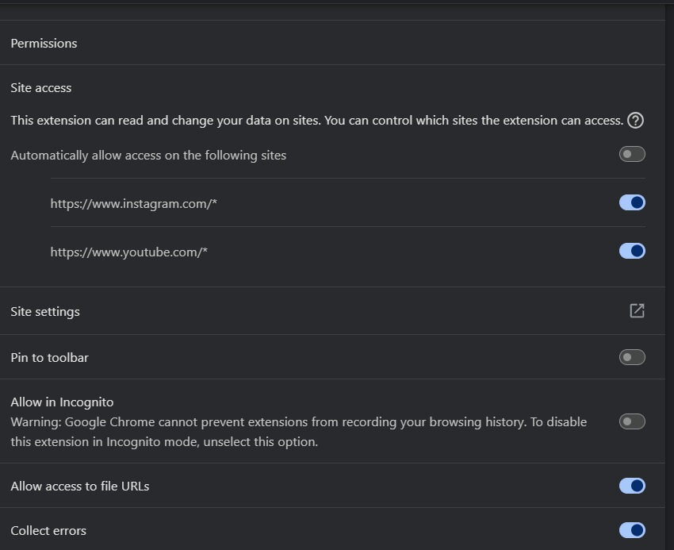
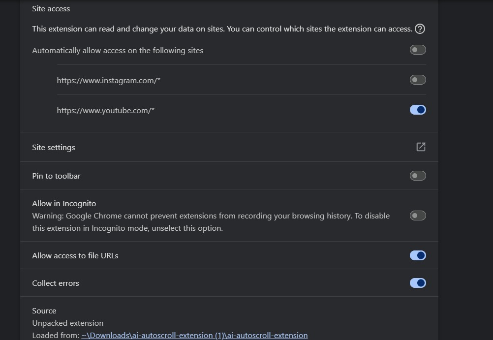

# AI Auto-Scroll: Shorts & Reels

Automatically advances YouTube Shorts and Instagram Reels using a real, on-device neural network that classifies what's actually in each video, and learns which content categories you watch fully vs. skip.

## 🎥 Demo

Watch the extension in action:

[▶️ Watch the Project Demo](https://youtu.be/ronTXGehjGk)

---

## 📸 Screenshots

### Extension Installed

### Instagram Reels Support

### YouTube Shorts Support

---

## 🧠 How It Works

The extension combines on-device computer vision with user behavior learning:

1. **MobileNet (via TensorFlow.js)** — a convolutional neural network — runs directly in your browser. For each reel/short, it grabs the current video frame and classifies it (e.g. "golden retriever," "pizza," "microphone," "beach").

2. Each classification gets mapped into a broader content bucket:
   `food`, `animals`, `people_fitness`, `music_performance`, `nature_travel`, `fashion_beauty`, `tech`, or `other`.

3. A **separate learned interest score** (0–1) is tracked per bucket and updated based on viewing and skipping behavior.

4. Scroll timing is calculated **per category** — if you consistently watch `food` content fully but skip `fashion_beauty` quickly, the system learns that distinction and adjusts independently.

5. Open the popup to see your **learned interest bars per category**, live.

---

## 🤖 Is this "real" AI?

Yes — MobileNet is a genuine, pretrained convolutional neural network that performs image classification on video frames directly in the browser using TensorFlow.js.

It is not a cloud API call or a simulated result.

### What it is not

It is not a large multimodal model that "understands" reels the way a human does, and it does not read captions, audio, or comments.

It performs frame-level object/scene classification using ImageNet's 1000 classes, which are then mapped into broader content categories.

The result is an AI-driven personalization system designed to run locally and privately inside a browser extension.

---

## Privacy

- All inference happens locally in your browser.
- No frame, image, or classification is sent to any server.
- Only the small learned numeric scores per category (e.g. `{"food": 0.62}`) are stored via `chrome.storage.local`.
- Images and videos are not stored.
- The model files (`tf.min.js`, `mobilenet.min.js`) are bundled inside the extension itself.
- The extension does not require a cloud AI API for its core classification functionality.

---

## Install (Chrome / Edge / Brave)

1. Download or clone this repository.
2. Go to `chrome://extensions` (or `edge://extensions`).
3. Turn on **Developer mode**.
4. Click **Load unpacked**.
5. Select the project folder containing `manifest.json`.
6. Click the extension icon and make sure site access is enabled for YouTube and Instagram.
7. Open YouTube Shorts or Instagram Reels.

---

## Files

- `manifest.json` — extension configuration and permissions
- `tf.min.js` — bundled TensorFlow.js library
- `mobilenet.min.js` — bundled MobileNet model/library
- `ai-engine.js` — loads the model, classifies video frames, and maps predictions into categories
- `common.js` — shared adaptive scoring engine and per-category learning
- `content-youtube.js` — YouTube Shorts detection and scrolling logic
- `content-instagram.js` — Instagram Reels detection and scrolling logic
- `popup.html` — extension popup interface
- `popup.js` — popup controls, sensitivity settings, and learned-category bars

---

## Tuning

- **Sensitivity** slider scales how many loops the extension waits, on top of the learned score.
- **Reset learned preferences** wipes all category scores back to neutral.
- The first classification on a fresh page load may take around 1–2 seconds while the model initializes.
- After initialization, subsequent classifications are faster because the model remains loaded.

---

## Limitations

- MobileNet's labels are general-purpose ImageNet categories (~1000 classes).
- It does not understand social-media-specific concepts such as "dance trend" or "meme format."
- Classification quality can vary depending on the visual content of the video.
- Instagram's DOM is obfuscated and changes frequently, so detection logic may require occasional updates.
- The extension analyzes visual frames and does not directly analyze audio, captions, comments, or the complete context of a video.
- This project is intended for personal/educational use and automates scrolling on the user's own browser session.

---

## Future Improvements

- Improve content classification accuracy.
- Add more social-media-specific content categories.
- Improve long-term personalization.
- Support additional short-video platforms.
- Optimize frame processing and model performance.
- Explore more advanced lightweight AI models.
- Add more detailed learning and analytics features.

---

## Tech Stack

- JavaScript
- HTML5
- CSS3
- Chrome Extension Manifest V3
- TensorFlow.js
- MobileNet
- Chrome Storage API
- YouTube Shorts
- Instagram Reels

---

## Author

**Sharon Shamsthuthi**

Computer Science & Engineering Student

GitHub: [Sharon1074](https://github.com/Sharon1074)
